<p align="center">
  <a href="https://winchxyz.github.io/credits-cubed/">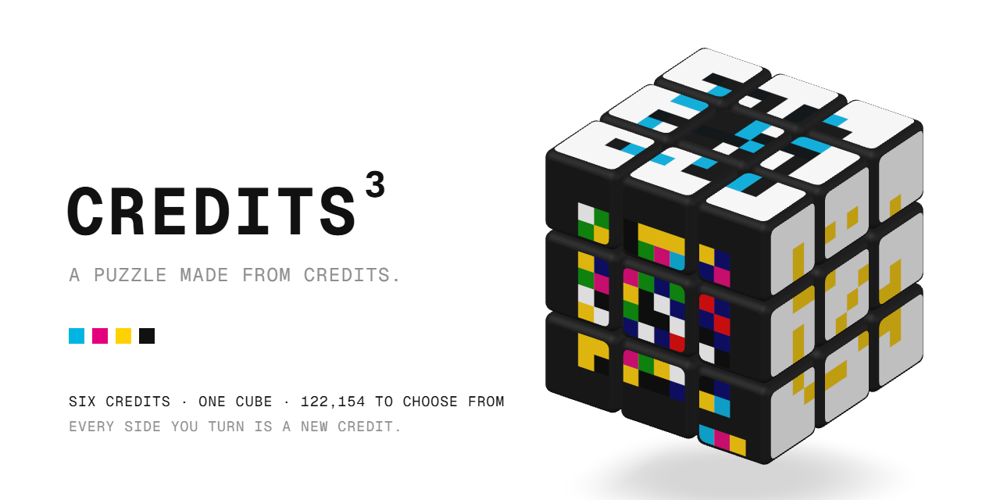</a>
</p>

<p align="center">
  <a href="https://winchxyz.github.io/credits-cubed/"></a>
  <a href="https://github.com/winchxyz/credits-cubed/actions/workflows/test.yml"></a>
  <a href="https://github.com/winchxyz/credits-cubed/deployments/github-pages"></a>
  <a href="LICENSE"></a>
  
  
  
  
</p>

<p align="center">
  <b>Six Credits. One cube. Scramble it, turn it back, or stop anywhere: every side you turn is a new Credit.</b><br>
  <a href="https://winchxyz.github.io/credits-cubed/">Play</a> ·
  <a href="#how-it-works">How it works</a> ·
  <a href="#run-it-locally">Run it locally</a> ·
  <a href="#faq">FAQ</a>
</p>

<p align="center">
  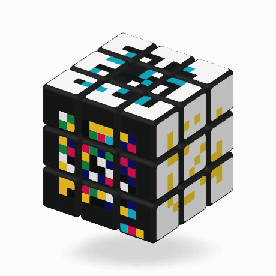
</p>

**Credits³** is a picture-cube puzzle built on [Credits](https://jack.art/credits), Jack Butcher's 2026 artwork made from acts of trust: every eligible $8 X Money payment became one Credit, an 8 × 8 grid printed from four CMYK plates that come from the SHA-256 of its transaction ID. The edition sealed at 122,154.

Put any six Credits on the sides of a cube, scramble it, and turn the layers until every side reads as its Credit again. Or don't: every side of a scrambled cube is a new Credit made of pieces of the other six, and you can download it.

Every Credit is drawn in your browser from its onchain seed and payment time, with the contract's own renderer ported line for line. There is no server, no API key and no build step.

## Contents

- [Features](#features)
- [Screenshots](#screenshots)
- [How it works](#how-it-works)
- [Exports](#exports)
- [Controls](#controls)
- [Run it locally](#run-it-locally)
- [Project layout](#project-layout)
- [Data and verification](#data-and-verification)
- [FAQ](#faq)
- [Credits and license](#credits-and-license)

## Features

| | |
|---|---|
| **Any Credit, any side** | Type an ID and scrub with ↑ ↓, roll one side with its dice, roll all six with **Random IDs**, pick six that share a trait with **Ordered**, or load the Credits a wallet or ENS name holds. |
| **Four cubes** | **2³, 3³ and 4³** cut each Credit's 12 × 12 raster into stickers along its own grid lines. **8³ pixels** makes every pixel of every Credit a piece you can move. |
| **Three bodies** | **Ink** (black plastic), **Paper** (white plastic) and **Flat**: sharp, full-bleed and unlit, so each side reads as one plain print. |
| **Solved by eye** | A side counts as registered when it *looks* right. Identical stickers are interchangeable, and any whole-cube orientation counts. |
| **Hint** | One arrow on the exact layer to turn and the move's name (`R′`, `3U`, …). Press again to play it. |
| **Solve** | Plays the way home turn by turn, names each move and lights the layer before it turns. Stop it at any point. |
| **New Credits** | Every side, as it is right now, shown as its own Credit. Download one, or all six on a single sheet. |
| **Receipts** | A solve prints a receipt. Like a Credit, every 8 in your time and turn count adds a proof-bar mark, and five of them turn the receipt black. |
| **Daily cube** | Every day gives everyone the same six Credits and the same scramble, and keeps your streak. |
| **Live process diagram** | Transaction ID → SHA-256 → the four plates → the 12 × 12 raster → the cut, for whichever side you select. |
| **Made to be handled** | Drag layers or orbit on desktop and touch, full keyboard control, light and dark themes, sound and motion toggles, and reduced-motion support. |

## Screenshots

<table>
  <tr>
    <td width="50%">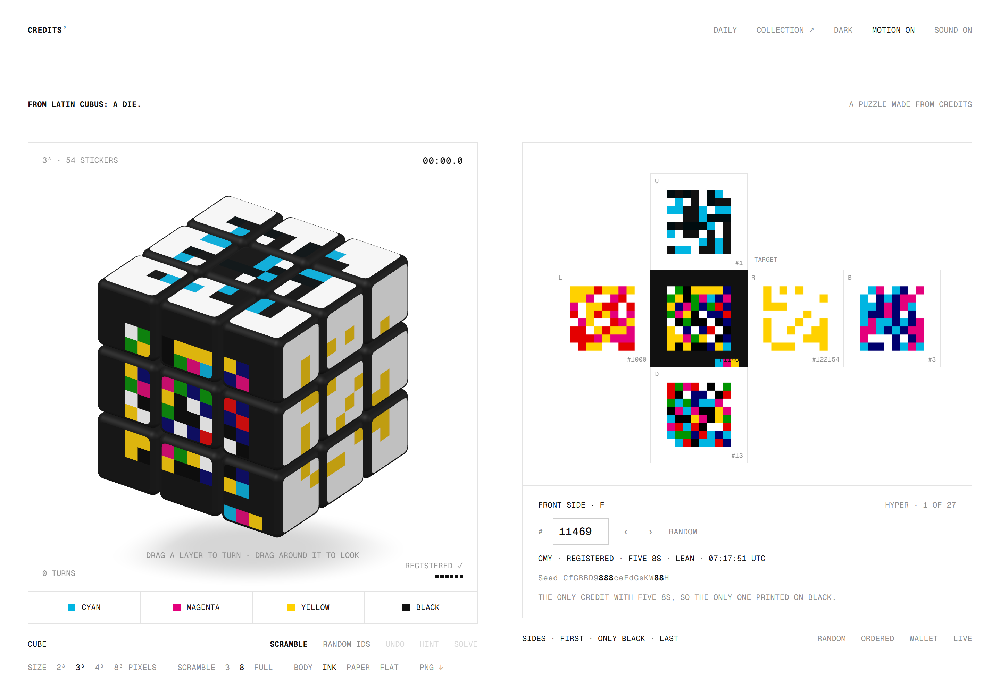</td>
    <td width="50%">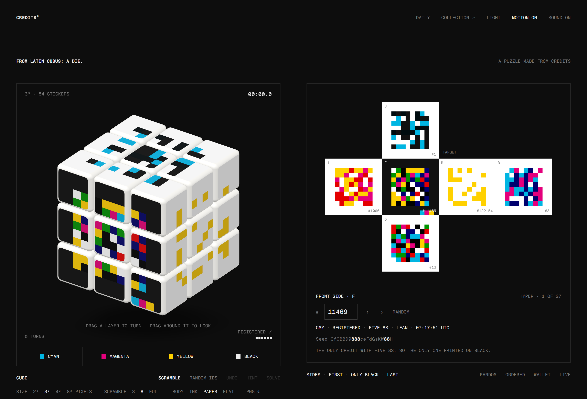</td>
  </tr>
  <tr>
    <td><sub><b>3³ · Ink.</b> #1 (the first Credit) on top, #11469 (the only one printed on black) in front, #122154 (the last) on the right.</sub></td>
    <td><sub><b>Dark theme.</b> The body switches to white plastic.</sub></td>
  </tr>
  <tr>
    <td>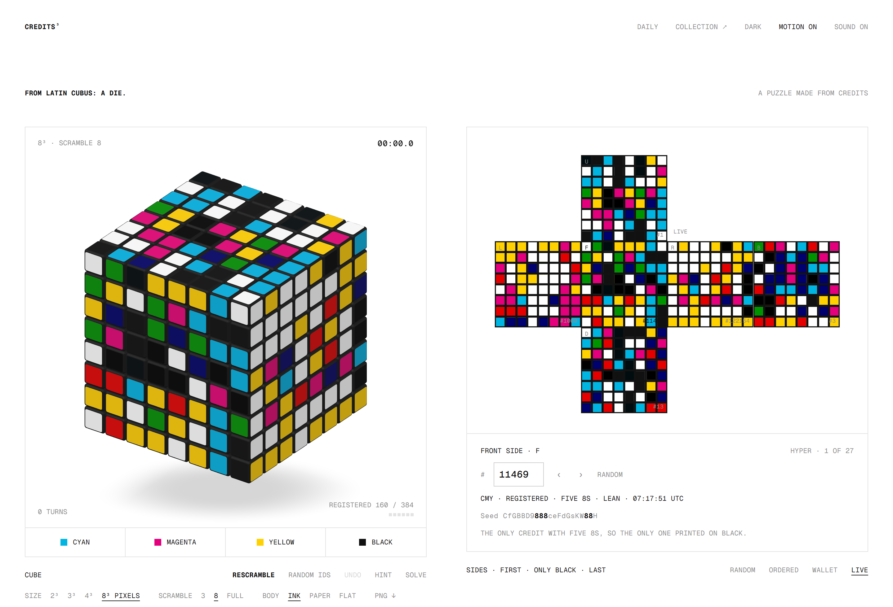</td>
    <td>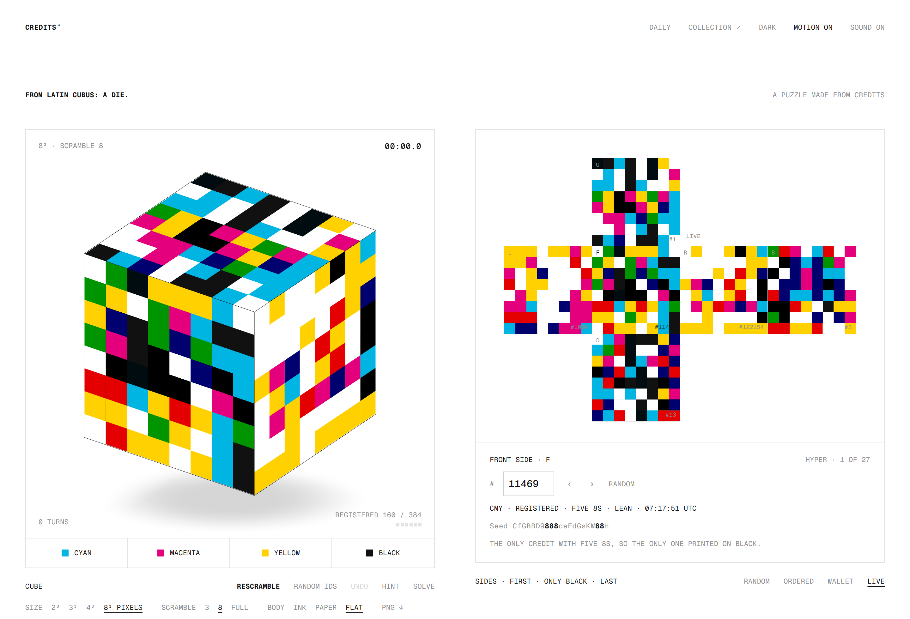</td>
  </tr>
  <tr>
    <td><sub><b>8³ pixels.</b> 384 stickers, one per plate pixel, with the live net on the right.</sub></td>
    <td><sub><b>Flat body.</b> No bevels and no gaps, so every scrambled side is a plain new Credit.</sub></td>
  </tr>
  <tr>
    <td>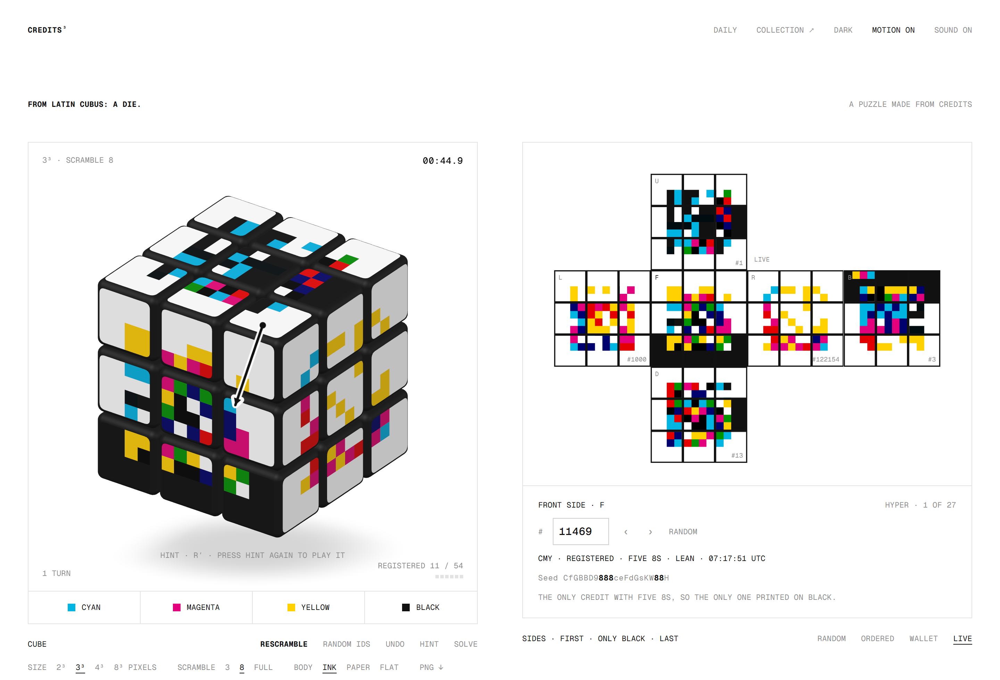</td>
    <td>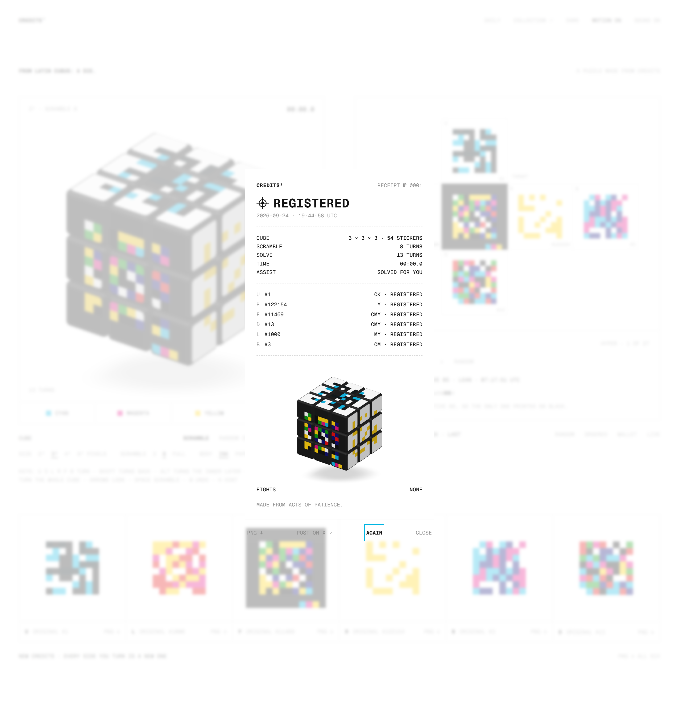</td>
  </tr>
  <tr>
    <td><sub><b>Hint.</b> One arrow, one named turn.</sub></td>
    <td><sub><b>Receipt.</b> Registered, with the turns, the time and the six sides.</sub></td>
  </tr>
  <tr>
    <td colspan="2">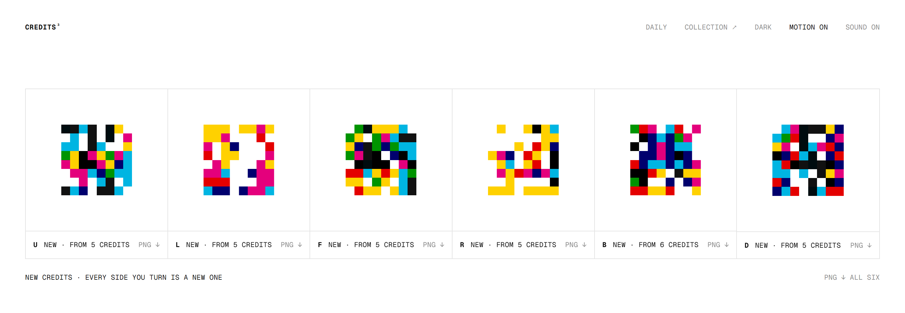</td>
  </tr>
  <tr>
    <td colspan="2"><sub><b>New Credits.</b> Each side of the scrambled 8³ cube as its own print, with PNG export.</sub></td>
  </tr>
  <tr>
    <td>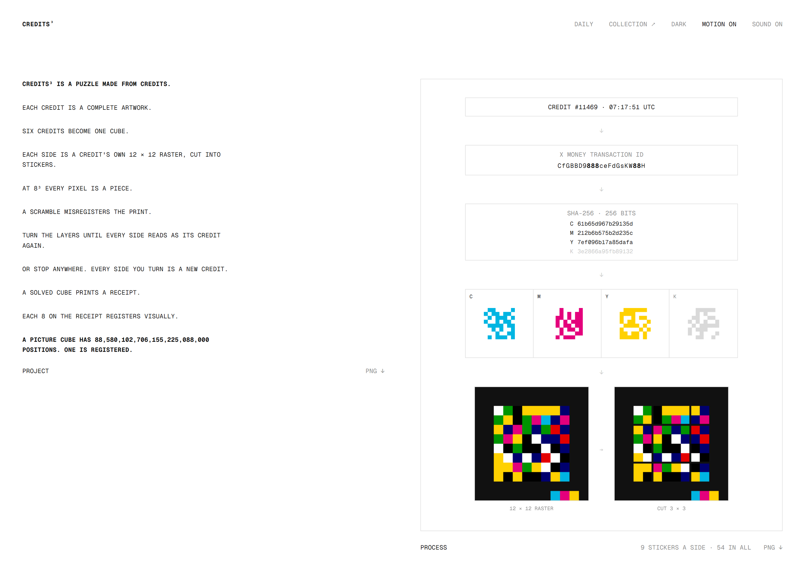</td>
    <td align="center">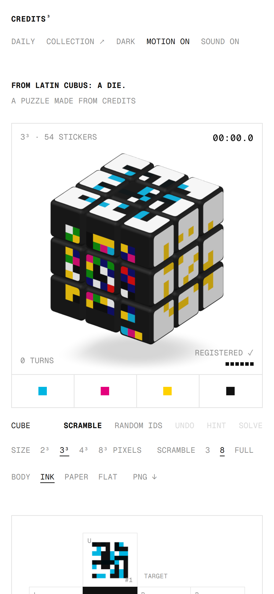</td>
  </tr>
  <tr>
    <td><sub><b>Project and process.</b> The statement, and how one Credit becomes a side.</sub></td>
    <td align="center"><sub><b>Phone.</b> The same page at 390 px.</sub></td>
  </tr>
</table>

## How it works

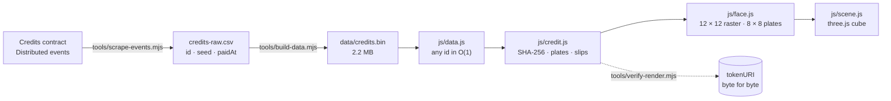

**The renderer is the contract's.** The Credits contract ([`0x9763…3043`](https://etherscan.io/address/0x97630aa70ab14ed9883b41dafccbc11349723043)) and its art contract are verified on [Sourcify](https://sourcify.dev). [`js/credit.js`](js/credit.js) ports `CreditDrawing` and `CreditArt` line for line: the SHA-256 of the 21-character transaction ID, one 64-bit plate per ink, the payment second picking one of 15 plate sets, the `/misprint` hash that slips plates by up to two pixels, the half-pixel re-centering, the premultiplied overprint palette, and the proof bar with one mark per `8` in the ID. `npm run verify:chain` fetches `tokenURI` for about 150 Credits (random ones plus every misprint and eights case) and compares the SVGs byte for byte.

**Every Credit ships with the page.** The seed and payment time of all 122,154 Credits come from the contract's `Distributed` events. [`tools/build-data.mjs`](tools/build-data.mjs) packs them into 2.2 MB: 16-byte base58 seeds, one trait byte, and delta-coded times. Any ID decodes instantly, so typing an ID updates the cube as you type.

**A side is the Credit's own raster.** The contract draws into a 12 × 12 raster, the space four 8 × 8 plates need "even at the maximum two-pixel slip". Each side is that window (SVG units 40–280), kept as a 24 × 24 half-pixel grid so misprints stay exact. 24 divides by 2, 3, 4 and 6, so sticker edges always fall on the art's own grid. The 8³ cube uses the four plates in register, one sticker per pixel.

**Solved by eye.** [`js/cube.js`](js/cube.js) tracks every cubie as an integer position and rotation. Each sticker gets a signature of what it shows after 0–3 quarter turns. The cube is registered when some whole-cube orientation (of 24) shows the right signature at every position, so two blank stickers can trade places. Hints and Solve follow the inverse of everything done so far, with same-axis turns merged and whole-cube rotations folded away.

**The look.** [`js/scene.js`](js/scene.js) uses three.js r169 with an orthographic camera, like a VisualizeValue diagram. The cubies are rounded boxes built from a subdivided cube. The studio lighting was tuned against measured pixel values so the top, front and right faces read as three tones without clipping. A shadow-only light casts a soft VSM contact shadow that fades out in an ellipse. Dragging a layer follows your finger and snaps to the nearest quarter turn.

## Exports

Every panel exports a 2400 × 3000 PNG, the size jack.art exports Credits at. Inside a sandboxed frame that blocks downloads, the image opens for you to save.

<table>
  <tr>
    <td width="33%">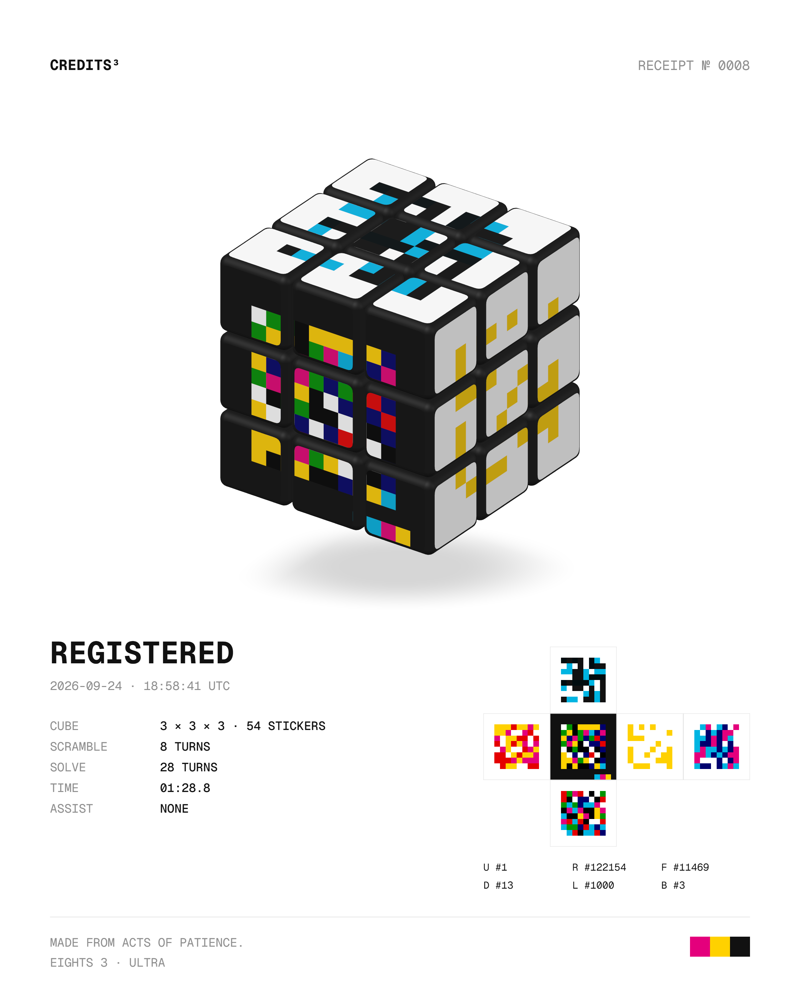</td>
    <td width="33%">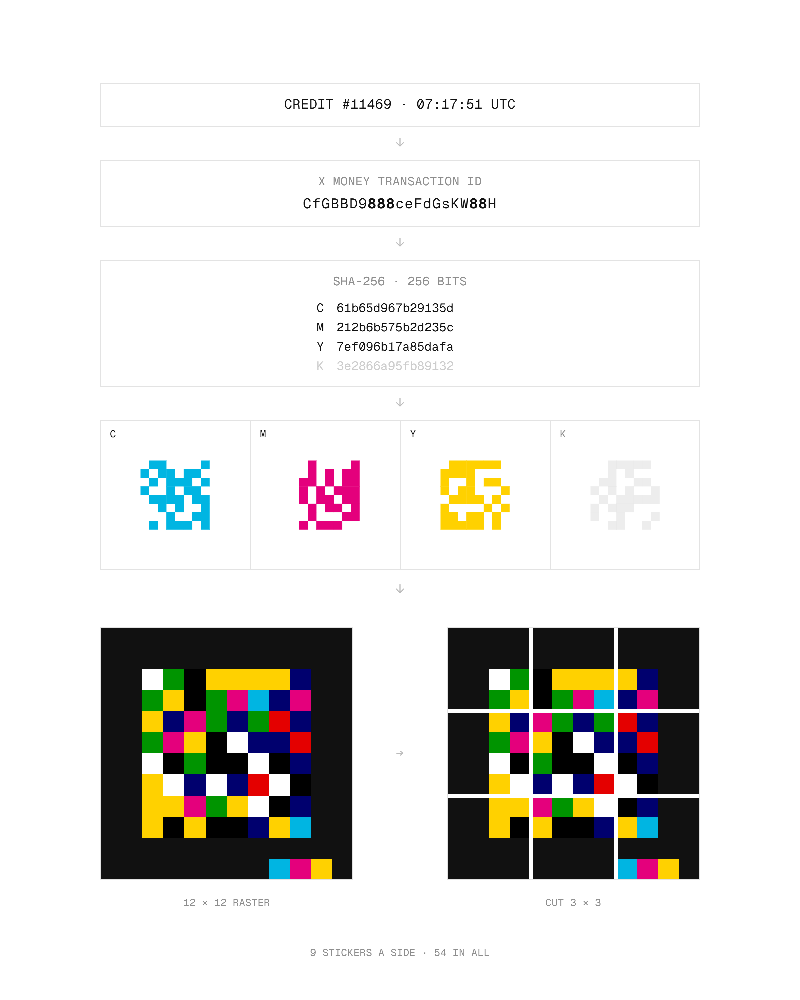</td>
    <td width="33%">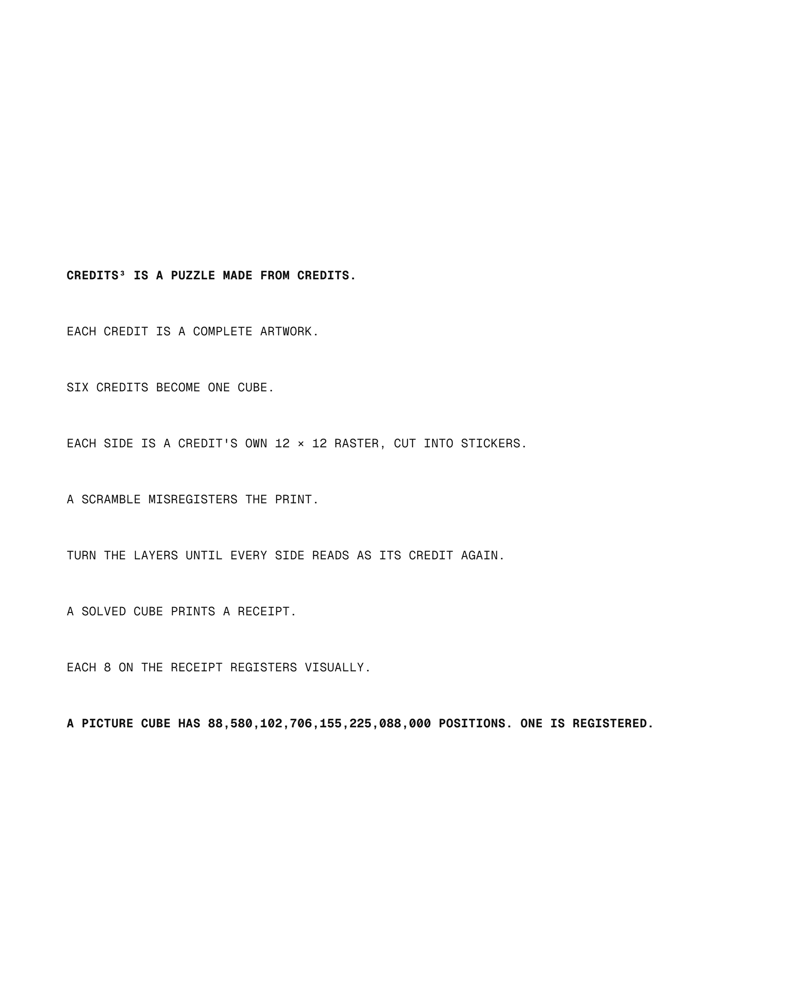</td>
  </tr>
  <tr>
    <td><sub>Receipt (sample numbers)</sub></td>
    <td><sub>Process · #11469</sub></td>
    <td><sub>Project statement</sub></td>
  </tr>
</table>

## Controls

| Input | Does |
|---|---|
| Drag a layer | Turn it: it follows the finger, then snaps to the nearest quarter turn |
| Drag around the cube | Look around (turntable) |
| `U` `D` `L` `R` `F` `B` | Turn the side that faces that way on screen · `Shift` turns it back · `Alt` turns the inner layer |
| `M` `E` `S` | Middle slices |
| `X` `Y` `Z` | Turn the whole cube |
| Arrow keys | Look around |
| `Space` | Scramble |
| `⌫` or `Ctrl`/`⌘` `Z` | Undo |
| `H` | Hint (press again to play it) |
| ↑ ↓ in the ID field | Previous or next Credit (`Shift` for 100) |

## Run it locally

```bash
git clone https://github.com/winchxyz/credits-cubed.git
cd credits-cubed
npm run dev
```

Then open <http://localhost:8880>. There is nothing to install. The page is plain ES modules and loads three.js from jsDelivr. Any static server works, as long as it serves over `http://` (modules don't load from `file://`).

| Script | What it does |
|---|---|
| `npm run dev` | Static dev server on port 8880 (no caching; `POST /__shot` saves captures to `shots/`) |
| `npm test` | Cube algebra and solved-by-eye checks on 2³, 3³ and 4³, then all 122,154 packed Credits against the source CSV |
| `npm run verify:chain` | Renders about 150 Credits locally and compares them with `tokenURI` on Ethereum, byte for byte |
| `npm run verify:wallet` | Keccak-256 and ENS namehash vectors, a live ENS lookup and `tokensOf` |
| `npm run scrape` | Rebuilds `tools/credits-raw.csv` from the contract's `Distributed` events |
| `npm run build:data` | Packs the CSV into `data/credits.bin` |
| `npm run rarity` | Scores every Credit with Jack's rarity formula ([R and S](https://x.com/jackbutcher/status/2103191042304753976)) |
| `npm run shots` | Regenerates the README screenshots in headless Chrome (needs the dev server) |
| `npm run build:artifact` | Writes a claude.ai Artifact version to `dist/` |

## Project layout

```
index.html            the page
css/style.css         one mono face, hairline frames, colour only from the inks
js/credit.js          the Credits renderer, ported from the verified contracts
js/data.js            reads data/credits.bin: seed, time and traits for any id
js/face.js            a Credit as a cube side: 24 × 24 half pixels, or 8 × 8 plates
js/cube.js            the puzzle: cubies, moves, solved-by-eye, path home, scrambles
js/scene.js           three.js: bodies, stickers, lights, drag, orbit, snapshots
js/app.js             the page: sides, session, hints, solve, receipts, daily, wallet
js/receipt.js         receipts and posters (the eights rule)
js/panels.js          the project and process prints
js/wallet.js          tokensOf(address) and ENS, over public RPCs
js/keccak.js          Keccak-256 for ENS names
js/audio.js           synthesised clicks and the four-ink chime
data/credits.bin      all 122,154 Credits (seed + payment time + traits)
tools/                data pipeline, tests, verification, screenshots
media/                README images
```

## Data and verification

- **Where the data comes from:** `seedOf` and `timestampOf` for every token, read from the contract's `Distributed(tokenId, to, seed, paidAt)` events. The edition is sealed (`isSealed() == true`, `supply() == 122154`), so the file never goes stale. Burned Credits stay drawable, because seeds remain readable after a burn.
- **What is proven:** `npm run verify:chain` shows the port matches the contract's SVG output byte for byte, including every kind of misprint and eights. `npm test` shows every packed seed and time decodes back to the scraped values.
- **Collection facts it surfaced:** exactly one Credit has five 8s (#11469, the only black ground), 26 have four (27 Hyper in all), and 978 are Loose misprints.

## FAQ

**Is this official?**
No. It's an unofficial fan project and isn't affiliated with Jack Butcher or Visualize Value.

**Do I need a wallet?**
No. Every Credit is already in the page. A wallet address or ENS name only loads the Credits it holds, through a read-only call to `tokensOf`. Nothing is ever signed or sent.

**Why are the cubes 2³, 3³, 4³ and 8³?**
Because those sizes cut the art on its own lines. The 12 × 12 raster divides evenly into 2, 3 and 4 stickers per side, and the 8 × 8 plates into 8.

**Why does a misprinted Credit look slightly different on the 8³ cube?**
The pixel cube uses the four plates in register, one sticker per pixel, so slipped plates snap back into place. The 2³–4³ cubes keep the misprint exactly.

**Why a 88,580,102,706,155,225,088,000 in the statement?**
That's the number of positions of a 3³ picture cube, where the centre stickers' rotation matters. It has two 8s at the front.

## Credits and license

- [Credits](https://jack.art/credits) is a work by **Jack Butcher**. The artworks belong to him, and this repository's license does not cover them.
- The drawing code in `js/credit.js` is ported from the MIT-licensed Credits contracts.
- Built with [three.js](https://threejs.org) (MIT) and set in [Geist Mono](https://vercel.com/font) (OFL).
- The code is released under the [MIT license](LICENSE), © 2026 winchxyz.
